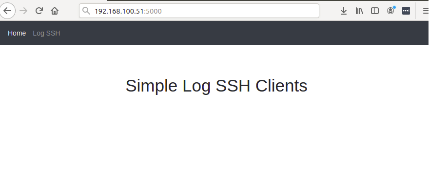
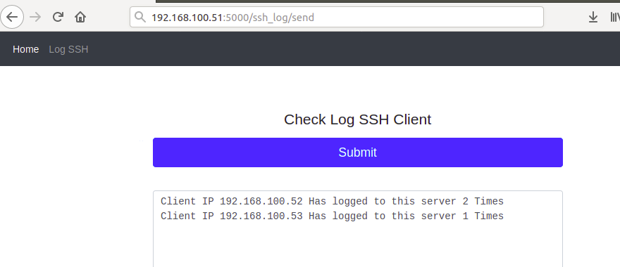

Simple apps for collect the number of times client logged into the server

Below list of server for this scenario

1. vm-server  : 192.168.100.51
2. vm-client1 : 192.168.100.52
3. vm-client2 : 192.168.100.53

How to run web apps

Execute the command below

```bash
flask run --host 0.0.0.0
```

Sample Screenshot



